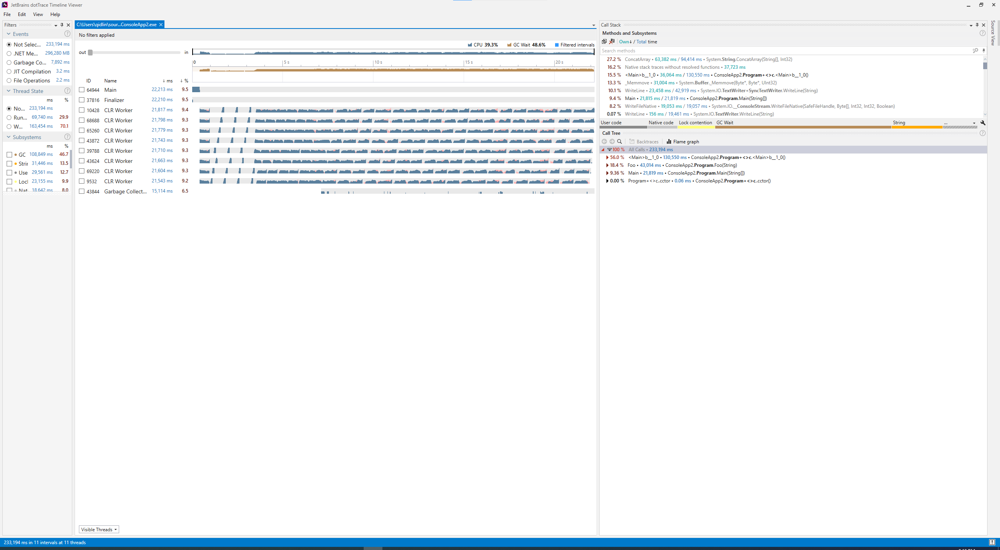
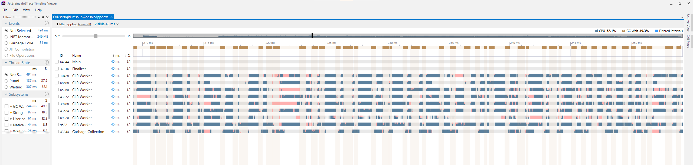
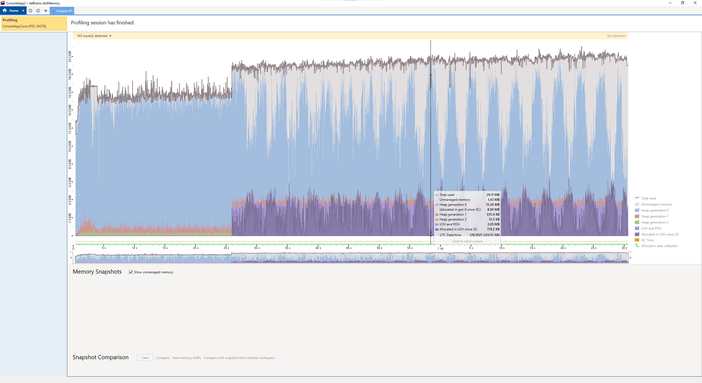
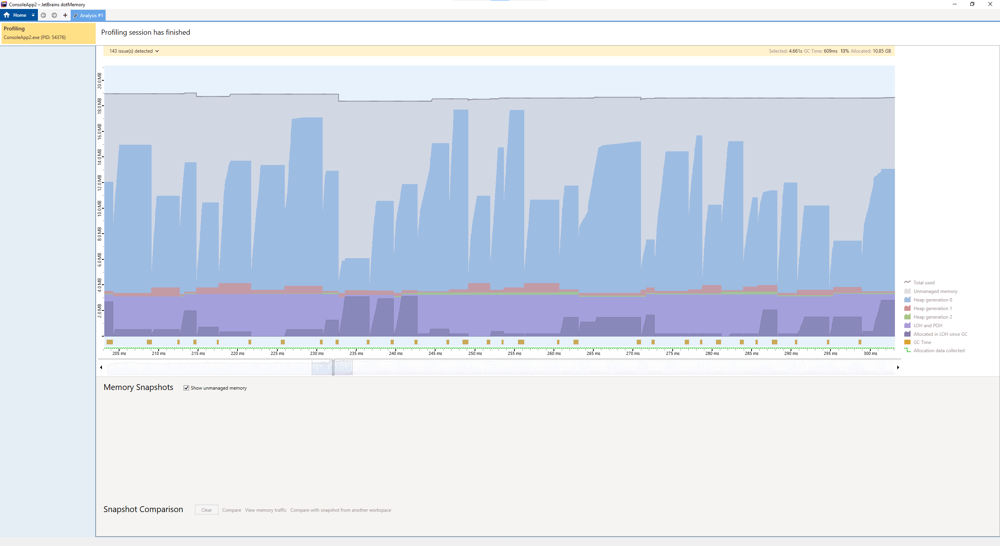
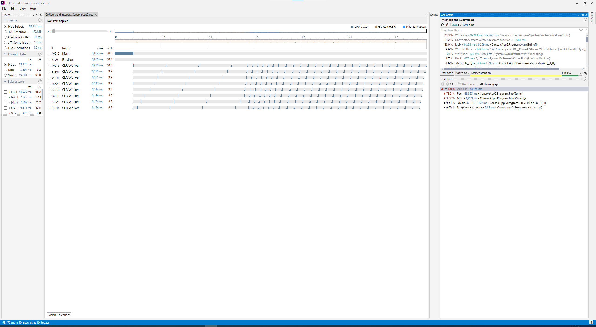
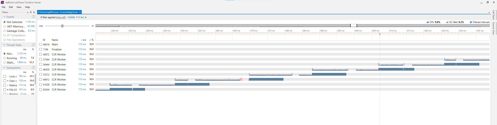
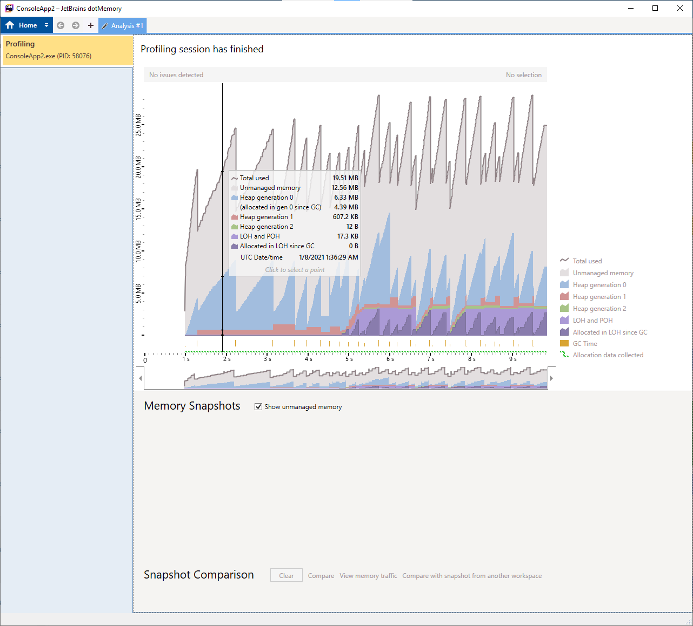

# 时间

2020-01-07


# 代码1

``` C#
using System;
using System.Threading;

namespace ConsoleApp2
{
    class Program
    {
        static void Foo(string x)
        {
            Console.WriteLine(x);

        }

        static void Main(string[] args)
        {
            Thread [] ts = new Thread[8];

            for (int i = 0; i < 8; i++)
            {
                ts[i] = new Thread(() =>
                {
                    for (int k = 0; k < 30; k++)
                    {
                        string x = "";
                        for (int j = 0; j < 10000; j++)
                            x = x + k + " " + k + " ";
                        Foo(x);
                    }
                });
                ts[i].Start();
            }

            for (int i = 0; i < 8; i++)
                ts[i].Join();
        }
    }
}
```

# 结果1











# 结论1

可以看到`gc`的时候线程都是卡住的。而且`gc`一直都在做。


# 代码2

把 String + 改成 StringBuilder.Append:

``` C#
using System;
using System.Threading;

namespace ConsoleApp2
{
    class Program
    {
        static void Foo(string x)
        {
            Console.WriteLine(x);

        }

        static void Main(string[] args)
        {
            Thread [] ts = new Thread[8];

            for (int i = 0; i < 8; i++)
            {
                ts[i] = new Thread(() =>
                {
                    for (int k = 0; k < 30; k++)
                    {
                        System.Text.StringBuilder x = new System.Text.StringBuilder();
                        for (int j = 0; j < 10000; j++)
                            x.Append(k).Append(" ").Append(k).Append(" ");
                        Foo(x.ToString());
                    }
                });
                ts[i].Start();
            }

            for (int i = 0; i < 8; i++)
                ts[i].Join();
        }
    }
}
```

# 结果2








# Knowledge

压缩大型对象堆 (LOH) -- [Windows 上的大型对象堆 (LOH) | Microsoft Docs](https://docs.microsoft.com/zh-cn/dotnet/standard/garbage-collection/large-object-heap)


