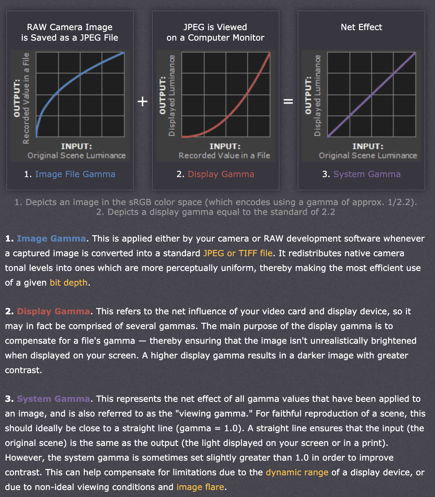

#git
#2020-10

# 为什么要有`Gamma`？
1. 假设你写了段程序，设置 A 点的亮度值值是 B 点亮度的两倍；运行时，A点的发光值会是B点的发光值的两倍。这样你人眼看到程序运行结果的时候，并不会觉得A点是B点的两倍亮度，因为人眼感受到的亮度不是正比于光子数量。

2. 为了使得上面的程序里，人眼能感受到A是b的两倍亮度，显示器在接受到操作系统送过来的两个点的亮度值之后，根据预先测试好的人眼感受能力函数，先对两个亮度值做一下反函数，再按照反函数后的值显示出来；这样人眼感受到的亮度值就是两倍。

3. 这个预先测试好的函数的反函数，大致就是 `display gamma`。现在行业标准已经收敛到 一个固定的 参数是 `2.2` 的 函数了。

4. 这时候，可以让人眼正确感受到程序生成的画面亮度了。可是如果是用相机拍摄数码照片后在显示器上显示，则亮度反而不对了。所以数码相机也会在接收到光子之后，针对`display gamma`，取个反函数后再存到照片里，这就是 `image gamma` 或者 `encoding gamma`。这样，人眼从显示器看到的照片中像素的亮度值，就和人眼面对真实场景一样了。

5. 以上，有 `display_gamma(image_gamma(x)) = x` 的关系。可是又有人觉得，因为拍照的画面有限，缺少了画面外的部分，这部分在真实场景中会影响人眼的感受；为了弥补这一部分，又可以可以调整 `image_gamma`，使得 `display_gamma(image_gamma(x)) ！= x`。具体调整多少，就是各个相机厂商自己的策略了。

6. 因为数码照片里的亮度都是离散化的，一定有信息损失的；`display gamma` 是 上凸函数，正好能使得暗区的信息损失比亮区少；正好人眼对亮区不敏感，所以这个 `display gamma` 的方案有利于保留更多人眼能识别的细节。

## 参考资料
https://www.cambridgeincolour.com/tutorials/gamma-correction.htm