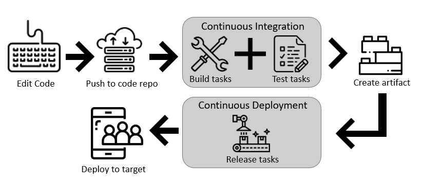
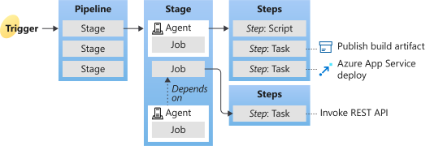
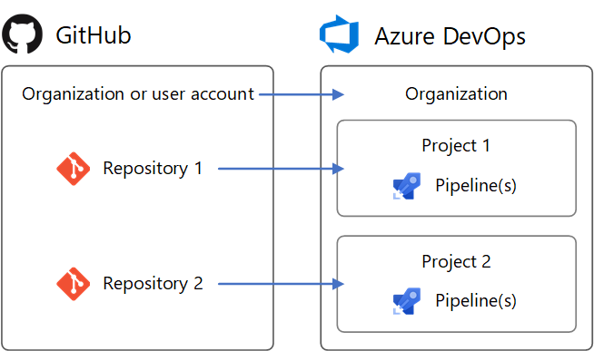
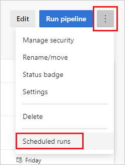

# 时间

2020-12-25


# 链接

[Azure Pipelines documentation | Microsoft Docs](https://docs.microsoft.com/en-us/azure/devops/pipelines/?view=azure-devops)


#  Define pipelines using YAML syntax


# Define pipelines using the Classic interface




# Organization

一般用这种链接`https://dev.azure.com/{yourorganization}`

可知第一级是 organization


# Project

可以用邮件加 team member


# 创建pipeline


# Pipeline basic

## [Azure Pipelines New User Guide - Key concepts - Azure Pipelines | Microsoft Docs](https://docs.microsoft.com/en-us/azure/devops/pipelines/get-started/key-pipelines-concepts?view=azure-devops)




pipeline 是调度的基本单位 ---- 当有batch选项的时候，会等一个pipeline跑完再开始基于新的commit重跑。但是 job 是最小单位？（解释清楚？）

## [Build Azure Repos Git repositories - Azure Pipelines | Microsoft Docs](https://docs.microsoft.com/en-us/azure/devops/pipelines/repos/azure-repos-git?view=azure-devops&tabs=yaml)

这一篇讲 pipeline 怎么样和 azure 的 git 仓库活动集成，比如怎样使得每一个commit提交都触发 pipeline。

其中主要讲 `trigger` 这个字段：

``` yaml
trigger:
  branches:
    include:
    - master
    - releases/*
    - feature/*
    exclude:
    - releases/old*
    - feature/*-working
  paths:
    include:
    - '*' # same as '/' for the repository root
    exclude:
    - 'docs/*' # same as 'docs/'
```


## [Build GitHub repositories - Azure Pipelines | Microsoft Docs](https://docs.microsoft.com/en-us/azure/devops/pipelines/repos/github?view=azure-devops&tabs=yaml)




> The repository in which the YAML file is present is called `self` repository. 

其他跳过了。没有耐心看。我又没有需求。


## [Configure schedules to run pipelines - Azure Pipelines | Microsoft Docs](https://docs.microsoft.com/en-us/azure/devops/pipelines/process/scheduled-triggers?view=azure-devops&tabs=yaml)

UI设置的 scheduled trigger 可以覆盖掉 YAML 中的：

> Scheduled triggers defined using the pipeline settings UI take precedence over YAML scheduled triggers.
>
> If your YAML pipeline has both YAML scheduled triggers and UI defined scheduled triggers, only the UI defined scheduled triggers are run. To run the YAML defined scheduled triggers in your YAML pipeline, you must remove the scheduled triggers defined in the pipeline setting UI. Once all UI scheduled triggers are removed, a push must be made in order for the YAML scheduled triggers to start running.

这一篇讲怎样配置 pipeline 的周期执行：

``` yaml
# YAML file in the main branch
schedules:
- cron: "0 0 * * *"
  displayName: Daily midnight build
  branches:
    include:
    - main
```

有个规则有意思：看起来 DevOps 会检查每一个 branch 的 每个 pipeline.YAML，如果 其中对应的 branch 规则和当前所在的 branch 对应的话，就会（也是才会）触发 scheduled run：

> Only when the `feature` branch is added to the branch filters in the YAML file **in the feature branch** will the scheduled build be added to the scheduler.

也就是说，如果 Branch A 的 YAML 里指定了 B， Branch B 的 YAML 里指定了 A，那么这两个都不执行……

默认如果没有代码改动就不会触发，如果像改变默认行为：

``` yaml
schedules:
- cron: ...
  ...
  always: true  // <---
```

运行次数限制： This limit is around 1000 runs per pipeline per week.

可以在这个界面里看实际情况：

 


## [Configure pipeline triggers - Azure Pipelines | Microsoft Docs](https://docs.microsoft.com/en-us/azure/devops/pipelines/process/pipeline-triggers?view=azure-devops&tabs=yaml)


这一篇说可以可以指定让你的 pipeline 依赖于 另一个 pipeline；当那一个有更新，你也会自动更新。通过在你的 YAML 里添加 resources\pipelines 来实现：

``` yaml
# this is being defined in app-ci pipeline
resources:
  pipelines:
  - pipeline: securitylib   # Name of the "pipeline resource"
    source: security-lib-ci # Name of the pipeline referenced by the "pipeline resource"
    trigger: 
      branches:
      - releases/*
      - main
```

其他跳过了。


## [Build and Release Tasks - Azure Pipelines | Microsoft Docs](https://docs.microsoft.com/en-us/azure/devops/pipelines/process/tasks?view=azure-devops&tabs=yaml)

tasks 分两种， buildin（[Catalog of the built-in tasks for build-release and Azure Pipelines & TFS - Azure Pipelines | Microsoft Docs](https://docs.microsoft.com/en-us/azure/devops/pipelines/tasks/?view=azure-devops)） 和 custom


task有全名，拼出来的：

```yaml
- task: myPublisherId.myExtensionId.myContributionId.myTaskName@1 #format example
- task: qetza.replacetokens.replacetokens-task.replacetokens@3 #working example
```


task 有版本：

``` yaml
- task: PublishTestResults@2
```


task 有控制系统：

``` yaml
- task: string  # reference to a task and version, e.g. "VSBuild@1"
  condition: expression     # see below
  continueOnError: boolean  # 'true' if future steps should run even if this step fails; defaults to 'false'
  enabled: boolean          # whether or not to run this step; defaults to 'true'
  timeoutInMinutes: number  # how long to wait before timing out the task
  target: string            # 'host' or the name of a container resource to target
```

``` yaml
- task: PublishTestResults@2
  inputs:
    testResultsFiles: "**/TEST-*.xml"
  condition: succeededOrFailed()
```

condition 有着四种选项

- 默认是前面全部成功
- succeededOrFailed()，不包括被取消的
- always()，包括被取消的
- failed()
- 各种 expression

task 有 target：

``` yaml
resources:
  containers:
  - container: pycontainer
    image: python:3.8

steps:
- task: SampleTask@1
  target: host
- task: AnotherTask@1
  target: pycontainer
  
#  the SampleTask runs on the host and AnotherTask runs in a container.
```

有 tooltask，用来往 pipeline 环境安装 nuget 等各种必要的软件。见 [Catalog of the built-in tasks for build-release and Azure Pipelines & TFS - Azure Pipelines | Microsoft Docs](https://docs.microsoft.com/en-us/azure/devops/pipelines/tasks/?view=azure-devops#tool)https://docs.microsoft.com/en-us/azure/devops/pipelines/tasks/tool/nuget?view=azure-devops)


## [Task Groups in Azure Pipelines and TFS - Azure Pipelines | Microsoft Docs](https://docs.microsoft.com/en-us/azure/devops/pipelines/library/task-groups?view=azure-devops)

task group 是一个用来复用 task 的手段。

task的变量参数会自动提取为所在的 task group 参数。

这个文档写得不是很顺，InsightsServices没有用这个，所以我跳过了。


## [Templates - Azure Pipelines | Microsoft Docs](https://docs.microsoft.com/en-us/azure/devops/pipelines/process/templates?view=azure-devops)

pipeline中的template类似于c++中的include

看起来 template 有两种用法，一个是被 extend 的，一种是被 insert 的

#### 其中被 extend的，自己可以定义 parameter，允许extension覆盖：

``` yaml
# File: simple-param.yml
parameters:
- name: yesNo # name of the parameter; required
  type: boolean # data type of the parameter; required
  default: false

steps:
- script: echo ${{ parameters.yesNo }}

# File: azure-pipelines.yml
trigger:
- master

extends:
  template: simple-param.yml
  parameters:
      yesNo: false # set to a non-boolean value to have the build fail
```

还可以和 控制语句（for、if）结合。具体参见原文档吧。

#### 被insert的

也可以有parameter

需要是 steps 、 jobs、stages、variables 这四种

用相对路径

还可以引用别的repo的。具体没看。

Template expressions 我就略过了。


## [Add a build or release task in an extension - Azure DevOps | Microsoft Docs](https://docs.microsoft.com/en-us/azure/devops/extend/develop/add-build-task?toc=%2Fazure%2Fdevops%2Fpipelines%2Ftoc.json&bc=%2Fazure%2Fdevops%2Fpipelines%2Fbreadcrumb%2Ftoc.json&view=azure-devops)

讲怎么制作自己的 task 插件并上传、发布


## [Jobs in Azure Pipelines and TFS - Azure Pipelines | Microsoft Docs](https://docs.microsoft.com/en-us/azure/devops/pipelines/process/phases?view=azure-devops&tabs=yaml)

Job 分三种：

- agent pool job
- server job
- container job

### 多job的情况

``` yaml
jobs:
- job: Test
  strategy:
    maxParallel: 2
    matrix: 
      US_IE:
        Location: US
        Browser: IE
      US_Chrome:
        Location: US
        Browser: Chrome
      Europe_Chrome:
        Location: Europe
        Browser: Chrome
# 会有三此触发（依次用不同的参数），但是最多有两个并行
```

其他懒得写了


## [Stages in Azure Pipelines - Azure Pipelines | Microsoft Docs](https://docs.microsoft.com/en-us/azure/devops/pipelines/process/stages?view=azure-devops&tabs=yaml)

只有一个 stage 的时候，可以不用写出来。

``` yaml
stages:
- stage: string  # name of the stage, A-Z, a-z, 0-9, and underscore
  displayName: string  # friendly name to display in the UI
  dependsOn: string | [ string ]
  condition: string
  pool: string | pool
  variables: { string: string } | [ variable | variableReference ] 
  jobs: [ job | templateReference]
```

通过操纵依赖，可以使并行；默认每一个stage都依赖于前一个。


## [Deployment jobs - Azure Pipelines | Microsoft Docs](https://docs.microsoft.com/en-us/azure/devops/pipelines/process/deployment-jobs?view=azure-devops)

``` yaml
jobs:
- deployment: string   # name of the deployment job, A-Z, a-z, 0-9, and underscore. The word "deploy" is a keyword and is unsupported as the deployment name.
  displayName: string  # friendly name to display in the UI
  pool:                # see pool schema
    name: string       # Use only global level variables for defining a pool name. Stage/job level variables are not supported to define pool name.
    demands: string | [ string ]
  workspace:
    clean: outputs | resources | all # what to clean up before the job runs
  dependsOn: string
  condition: string
  continueOnError: boolean                # 'true' if future jobs should run even if this job fails; defaults to 'false'
  container: containerReference # container to run this job inside
  services: { string: string | container } # container resources to run as a service container
  timeoutInMinutes: nonEmptyString        # how long to run the job before automatically cancelling
  cancelTimeoutInMinutes: nonEmptyString  # how much time to give 'run always even if cancelled tasks' before killing them
  variables: # several syntaxes, see specific section
  environment: string  # target environment name and optionally a resource name to record the deployment history; format: <environment-name>.<resource-name>
  strategy:
    runOnce:    #rolling, canary are the other strategies that are supported
      deploy:
        steps: [ script | bash | pwsh | powershell | checkout | task | templateReference ]
```

系统自带的 deploy task 可以提供额外的 历史记录、回滚等补充。它是通过 lifecycle hooks（[Deployment jobs - Azure Pipelines | Microsoft Docs](https://docs.microsoft.com/en-us/azure/devops/pipelines/process/deployment-jobs?view=azure-devops#descriptions-of-lifecycle-hooks)） 来做的。

三种 deploy strategy (看了文档后我会**不大明白它们的区别**)

- runonce
- rolling
- canary

每个 lifecycle hook 可以定义一些变量输出到全局，使得别的后续步骤可以使用：

``` yaml
strategy:                  
      runOnce:
        deploy:
          steps:
          - bash: echo "##vso[task.setvariable variable=myOutputVar;isOutput=true]this is the deployment variable value"
            name: setvarStep
          - bash: echo $(System.JobName)
```


## [Demands - Azure Pipelines | Microsoft Docs](https://docs.microsoft.com/en-us/azure/devops/pipelines/process/demands?view=azure-devops&tabs=yaml)

Demands 是 Pool 的属性。意思是跑这些任务需要满足什么条件（比如msbuild必须被安装之类的）。


