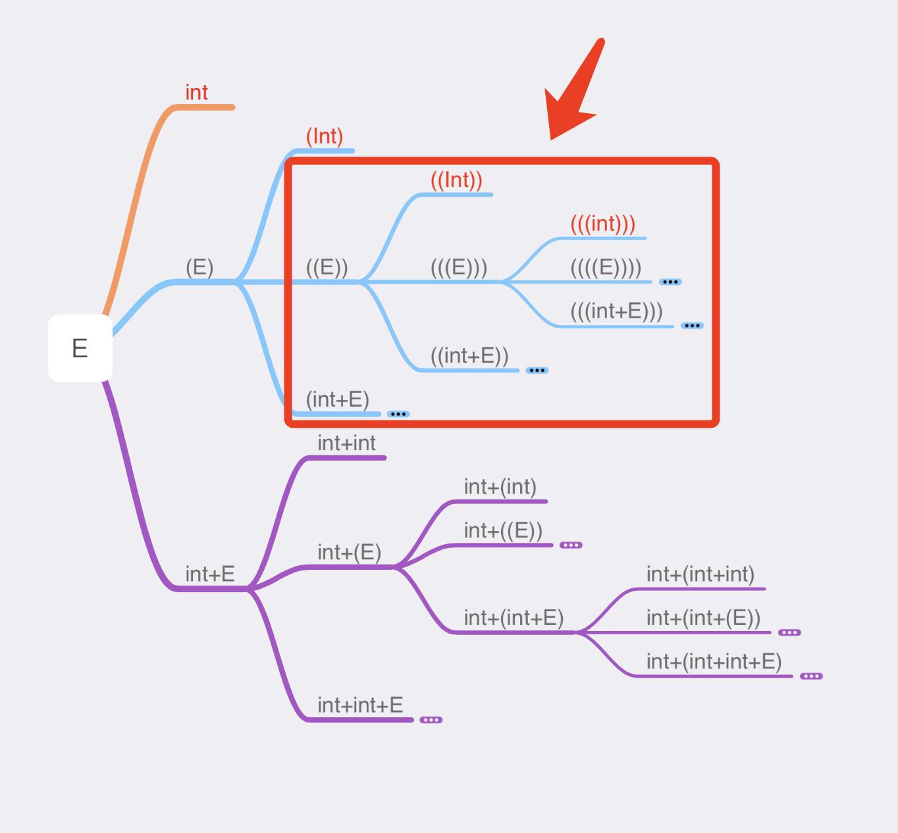
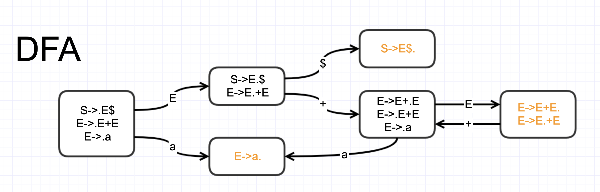

# 例子1

语法规则是：

待匹配代码是：`3+(4+5)`


## 方法

我们把语法规则展开，可以得到 

其中红色字体的 `int` `(int)` `((int))` `(((int)))` ... `int+int` `int+(int)` ... `int+(int+int)` ... 等无法再展开的，就是我们需要挨个过一遍的：

`int` 是否匹配 `3+(4+5)` ? 答案是否。

| 代码         | `3`   | `+`   | `(`  | `4`   | `+`  | `5`   | `)`  |
| ------------ | ----- | ----- | ---- | ----- | ---- | ----- | ---- |
| token        | `int` | `+`   | `(`  | `int` | `+`  | `int` | `)`  |
| 待匹配的规则 | `int` |       |      |       |      |       |      |
| 匹配结果     | Y     | **N** |      |       |      |       |      |

`(int)`是否匹配 `3+(4+5)`？答案是否。

| 代码         | `3`   | `+`   | `(`  | `4`   | `+`  | `5`   | `)`  |
| ------------ | ----- | ----- | ---- | ----- | ---- | ----- | ---- |
| token        | `int` | `+`   | `(`  | `int` | `+`  | `int` | `)`  |
| 待匹配的规则 | `(`   | `int` | `)`  |       |      |       |      |
| 匹配结果     | N     |       |      |       |      |       |      |

`((int))`是否匹配`3+(4+5)`？ 答案是否。

| 代码         | `3`   | `+`  | `(`   | `4`   | `+`  | `5`   | `)`  |
| ------------ | ----- | ---- | ----- | ----- | ---- | ----- | ---- |
| token        | `int` | `+`  | `(`   | `int` | `+`  | `int` | `)`  |
| 待匹配的规则 | `(`   | `(`  | `int` | `)`   | `)`  |       |      |
| 匹配结果     | N     |      |       |       |      |       |      |

。。。

一直到 `int+(int+int)`，是否匹配`3+(4+5)`？答案是yes。

| 代码         | `3`   | `+`  | `(`  | `4`   | `+`  | `5`   | `)`  |
| ------------ | ----- | ---- | ---- | ----- | ---- | ----- | ---- |
| token        | `int` | `+`  | `(`  | `int` | `+`  | `int` | `)`  |
| 待匹配的规则 | `int` | `+`  | `(`  | `int` | `+`  | `int` | `)`  |
| 匹配结果     | Y     | Y    | `Y`  | Y     | Y    | Y     | Y    |

于是我们找到了答案。


## 优化1

在上面第一次匹配检查中，一共检查了1对字符串，也就是规则里的`int`是否匹配代码里的`3`。


在第二次匹配检查中，一共检查了1对字符串，也是规则里的`（`是否匹配代码里的`3`。


第3次也是。


注意第2次检查和第3次检查失败的原因是一样的，都是因为第一个字符不匹配：

这个位置的匹配检查重复了很多次，这无疑是浪费的。实际上，第一次知道这一对不匹配后，就应该把 从 `(E)`展开的所有规则排除在外了。也就是说，下图红框里的根本就不用尝试，直接跳过就行了：



类似的，下图的红框的展开也只需要一次检查，就能知道一定会失败了，因为规则里的第4个字符是`(`，而代码第4个token是`4`：


| 代码         | `3`   | `+`  | `(`  | `4`   | `+`  | `5`   | `)`  |
| ------------ | ----- | ---- | ---- | ----- | ---- | ----- | ---- |
| token        | `int` | `+`  | `(`  | `int` | `+`  | `int` | `)`  |
| 待匹配的规则 | `int` | `+`  | `(`  | `(`   | `E`  | `)`   | `)`  |
| 匹配结果     | Y     | Y    | Y    | N     |      |       |      |

这样就减少了很多次搜索了。


## 优化2

观察规则，如果我当前正要匹配整个 `E`，但是代码的下一个token是 `int`，那么 `E->(E)`显然是不需要尝试的。而如果代码的下一个token是`(`，那么 `E->int` 和 `E->int+E` 显然也是不需要尝试的。我们可以利用这些信息。

我们首先构造一个表:

|      | int              | (          | )    | +    |
| ---- | ---------------- | ---------- | ---- | ---- |
| E    | `E->int | int+E` | `E -> (E)` |      |      |

这个表的意思是，如果我要匹配规则`E`，而代码里下一个字符是`int`，那我就只考虑 `E->int` 和 `E->int+E` 这两个规则。如果代码里下一个字符是 `(`，就只考虑 `E->(E)` 这个规则。如果代码里下一个字符是 `)` 或者 `+`，因为没有适用的规则，就直接报错。

然后完整的搜索过程如下。“序号”是为了方便描述。规则里`int.+E`中的`.`表示左侧的部分已经匹配成功，右侧的部分尚待匹配。代码里的`.`也是类似的意思。

| 序号 | 完整的规则展开式 | 完整的代码 | 规则里下个Expression | 代码里下个token | 适用的production | 该token匹配成功？ | 备注                                        |
| ---- | ------------------ | ----------- | -------------------- | --------------- | ---------------- | ----------------- | ------------------------------------------- |
| 1    | `.E`               | `.3+(4+5)`  | `E`                  | `3`             | `E->int|int+E`  |                   | 2和4是并列关系。如果2失败，则还要尝试4.     |
| 2    | `.int`             | `.3+(4+5)`  | `int`                | `3`             |                  | Y                 |                                             |
| 3    | `int.`             | `3.+(4+5)`  |                      | `+`             |                  | **N**             | 需要回溯到4                                 |
| 4    | `.int+E`           | `.3+(4+5)`  | `int`                | `3`             |                  | Y                 |                                             |
| 5    | `int.+E`           | `3.+(4+5)`  | ``+``                | `+`             |                  | Y                 |                                             |
| 6    | `int+.E`           | `3+.(4+5`)         | `E` | `(` |`E->(E)`|||
| 7    | `int+.(E)`         | `3+.(4+5)`  | `(`                  | `(`             |                  | Y                 |                                             |
| 8    | `int+(.E)`         | `3+(.4+5)`  | `E`                  | `4`             | `E->int|int+E` |                   | 9和11是并列关系。如果9失败，则还要尝试11.   |
| 9    | `int+(.int)`       | `3+(.4+5)`  | `int`                | `4`             |                  | Y                 |                                             |
| 10   | `int+(int.)`       | `3+(4.+5)`  | ``)``                | `+`             |                  | **N**             | 需要回溯到11                                |
| 11   | `int+(.int+E)`     | `3+(.4+5)`  | `int`                | `4`             |                  | Y                 |                                             |
| 12   | `int+(int.+E)`     | `3+(4.+5)`  | `+`                  | `+`             |                  | Y                 |                                             |
| 13   | `int+(int+.E)`     | `3+(4+.5)`  | `E`                  | `5`             | `E->int|int+E` |                   | 14和17是并列关系。如果14失败，则还要尝试17. |
| 14   | `int+(int+.int)`   | `3+(4+.5)`  | `int`                | `5`             |                  | Y                 |                                             |
| 15   | `int+(int+int.)`   | `3+(4+5.)`  | ``)``                | `)`             |                  | Y                 |                                             |
| 16   | `int+(int+int).`   | `3+(4+5).`  |                    |               |                  |                   | 成功了                                      |
| 17   | `int+(int+.int+E)` | `3+(4+.5)`  | `3+(4+.5)`           |                 |                  |                   | 不需要左了 |

可以看出，这个方法让我们省掉了很多 `(` 匹配 `int` 的检查。


## 优化3

还可以优化。当匹配 `E` 的时候，如果下个token是`int`，则需要考虑 这两个规则：`E->int` 和 `E->int+E` 两个规则。

但如果我们把语法改写一下（其中`null`表示匹配空字符串）：


相同的办法提前建立表格：

|      | `int`      | `(`      | `)`       | `+`     |
| ---- | ---------- | -------- | --------- | ------- |
| `E`  | `E->int F` | `E->(E)` |           |         |
| `F`  |            |          | `F->null` | `F->+E` |

| 代号 | 完整的规则展开式  | 完整的代码 | 下个Expression | 下个token | 选择的production | 该token匹配成功？ | 备注   |
| ---- | ----------------- | ---------- | -------------- | --------- | ---------------- | ----------------- | ------ |
| 1    | `.E`              | `.3+(4+5)` | `E`            | `3`       | `E->intF`        |                   |        |
| 2    | `.intF`           | `.3+(4+5)` | `int`          | `3`       |                  | Y                 |        |
| 3    | `int.F`           | `3.+(4+5)` | `F`            | `+`       | `F->+E`          |                   |        |
| 4    | `int.+E`          | `3.+(4+5)` | `+`            | `+`       |                  | Y                 |        |
| 5    | `int+.E`          | `3+.(4+5)` | `E`            | `(`       | `E->(E)`         |                   |        |
| 6    | `int+.(E)`        | `3+.(4+5)` | `(`            | `(`       |                  | Y                 |        |
| 7    | `int+(.E)`        | `3+(.4+5)` | `E`            | `4`       | `E->intF`        |                   |        |
| 8    | `int+(.intF)`     | `3+(.4+5)` | `int`          | `4`       |                  | Y                 |        |
| 9    | `int+(int.F)`     | `3+(4.+5)` | `F`            | `+`       | `F->+E`          |                   |        |
| 10   | `int+(int.+E)`    | `3+(4.+5)` | `+`            | `+`       |                  | Y                 |        |
| 11   | `int+(int+.E)`    | `3+(4+.5)` | `E`            | `5`       | `E->intF`        |                   |        |
| 12   | `int+(int+.intF)` | `3+(4+.5)` | `int`          | `5`       |                  | Y                 |        |
| 13   | `int+(int+int.F)` | `3+(4+5.)` | `F`            | `)`       | `F->null`        |                   |        |
| 14   | `int+(int+int.)`  | `3+(4+5.)` | `)`            | `)`       |                  | Y                 |        |
| 15   | `int+(int+int).`  | `3+(4+5).` |                |           |                  |                   | 成功了 |

时间复杂度：每一次要么选择一个production进行reduce，要么匹配一个token。所以时间复杂度是 number_of_reduction + length_of(code_string)。

## LL1表的建立

下一个问题是怎么建立那个表，尤其是红框部分是怎么建立的：


为什么当匹配`F`时候，下个字符是 `）` 的时候，可以选择 `F->null`? 这是因为有这样的例子存在： 用 `E->(intF)` 去匹配 `(3)` 这样的代码。确切的说，当代码中下一个token在F的Follow Set中的时候，`F`可以取 `F->null`.

## Follow Set


`Follow(E) <= Follow(F)`, because `F->+E`

`Follow(F) <= Follow(E)`, because `E->intF`

so `Follow(E) = Follow(F)`

`Follow(E) = {)}`

`Follow(F) = {)}`


## 重新思考

每一次用 production 替换 代码的过程，其实都是一次正则表达式的匹配过程。我们可以画出NFA如下。


为了运行效率，我们转换成 DFA。其实就是把 ε-闭包 合并起来：


然后就可以对代码进行N轮 reduction 了：


一共进行了8轮正则表达式匹配。总的时间复杂度不超过 `number_of_reduction * length_of(code_string)`

## 优化

注意到每一轮的正则表达式匹配都是从头开始重新匹配。但其实，每相邻两轮，其开头部分都是一样的。不一样的部分仅仅是因为上一轮的reduction导致的。所以其实可以跳过一部分匹配。举个例子，从 `3+(4F)` 到 `3+(E)` 的时候，我们其实知道 `3+(` 是匹配到下图中黄色的状态：


用 `E->intF` 替换之后，我们要进行下一轮的正则表达式匹配的时候，只需要从黄色的部分开始，接着往下匹配就行了：


从而可以省下很多重复匹配。总的时间复杂度会变成不超过 `number_of_reduction + length_of(code_string)`。可以看到，它的复杂度和 LL1 是一样的。

# 例子2

语法规则：`E->Ea|b`，其中 `a` 和 `b` 指字母 `a` 和 `b`。待匹配代码是 `baaaaaa`。

如果我们用 例子1中的回溯的方法，会遇到麻烦，因为 每次都选择 `E->Ea` 的展开，就会陷入死循环。

如果用 LL(1)的方法，建造表如下：它实际上起不到优化的效果。这是因为 `E->Ea` 这条展开式没有带来任何新进展。

|      |  a   |          b          |
| :--: | :--: | :-----------------: |
|  E   |      | `E->b`<br />`E->Ea` |

但是如果用正则表达式的方法，就可以成功。


于是有推导：

```
   baaaaaa
-> Eaaaaaa
->  Eaaaaa
->   Eaaaa
->    Eaaa
->     Eaa
->      Ea
->       E
```

可见正则表达式方法的优势。那么这个优势的root cause在哪呢？**这个问题我暂时还回答不了**。

# 例子3

语法规则是 `E->E+E|a`。待匹配代码是 `a+a`。

考虑正则表达式的方式。




DFA中在最右侧那个状态下，如果下一个字符是 +，那么既可以 reduce，也可以 shift。会有问题。

```
   a+a+a
-> E+a+a
-> E+E+a
-> E+a  // <---
-> E
```

还是

```
   a+a+a
-> E+a+a
-> E+E+a
-> E+E+E  // <---
-> E+E
-> E
```

呢？

这种分歧是需要额外解决的。
