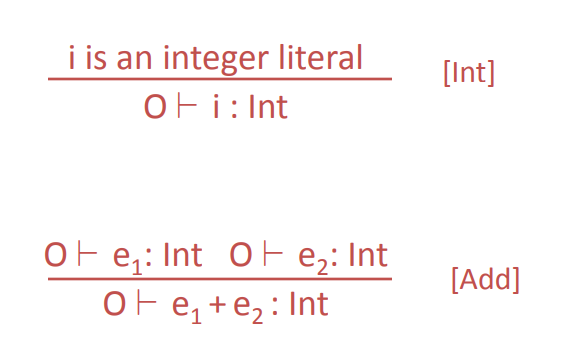

# 这套符号系统的目的？



我第一反应是这套系统就是 把一些显而易见的事情重复一遍，不明白为什么要做这个。

后来觉得是因为要用纯符号来精确表达，从而可以避开每个人的语言问题。这个有点类似于数学里 “任给一个epsilon”之类的。


# 设计这套管道的目的？

这套是规则，只有一套。

需要应用在不同的代码上，一遍又一遍的。所以需要一套容易、高效的检测手段。


# `O |- e: int`

实际上就是说，在O里e是int的类型。实际上 O 就是一个hash表。


# `O,M,C |- e:T`

实际上 O 是变量的 hash 表，M是函数的hash表，C是用来表示 self的。

这意味着，O和M中可以有相同名字的符号。


# static dispatch vs dynamic dispatch

static dispatch 就是编译期可以确定函数地址的

dynamic dispatch 需要runtime才可以确定地址


# self

含义上来说，相同的 self 代码，在父类 A 中指代 A，在子类 B 中指代 B。

它适用于这个场景：

```
class A { 
	int x;
	virtual A& set(int x) {
		*this.x = x;
		return *this;
	}
};
class B : A {
	void foo() {}
};
```

如下代码会编译失败，因为 set() 的返回结果是 A&，没有 foo() 函数：

```
B().set(3).foo();
```

如下修改虽然可行，但是啰嗦：

```
class A { 
	int x;
	virtual A& set(int x) {
		*this.x = x;
		return *this;
	}
};
class B : A {
	void foo() {}
	virtual B& set(int x) {
		*this.x = x;
		return *this;
	}
};
```

所以可以从语言层面设计 self。

```
class A { 
	int x;
	virtual self set(int x) {
		*this.x = x;
		return *this;
	}
};
class B : A {
	void foo() {}
};
```

